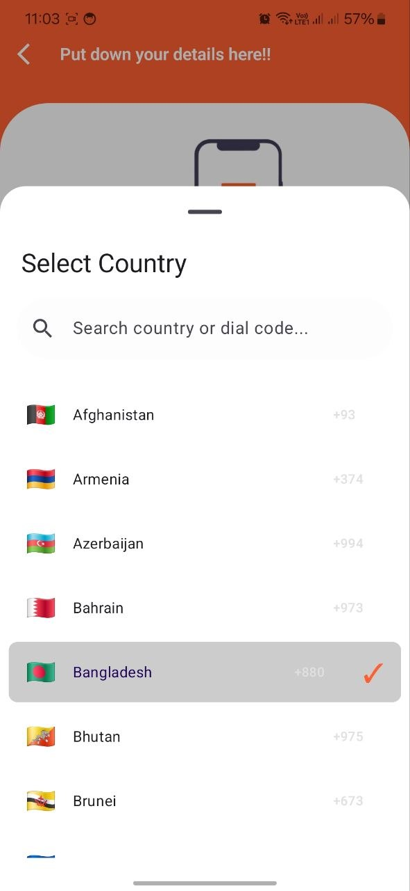
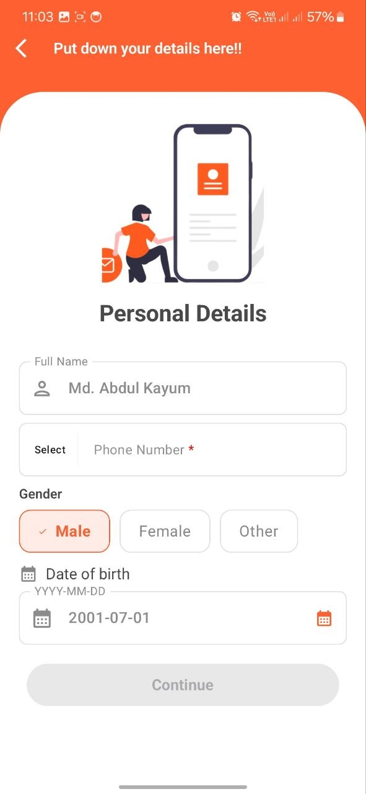
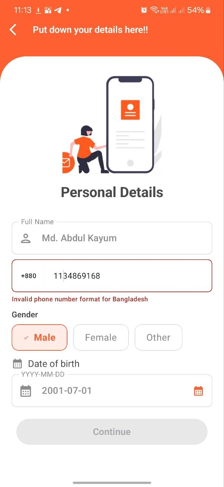

# 🌍 CMP Country Picker

A powerful, flexible, and fully customizable **Country Picker & Phone Number Input library** for **Jetpack Compose** and **Compose Multiplatform**.

> Designed for modern apps that need seamless international phone number handling with clean UI and developer-friendly APIs.

---

## ✨ Features

* 🌎 **250+ Countries Supported**
* 🔍 **Searchable Country List**
* 📱 **Country Picker Bottom Sheet**
* ☎️ **Smart Phone Number Input**
* ✅ **Country-based Validation**
* 🔄 **Auto Parsing of International Numbers** (`+880...`)
* 🎨 **Fully Customizable UI & Theme**
* 🚫 **Whitelist / Blacklist Countries**
* 🌐 **Compose Multiplatform Ready**
* 🧩 **Use Built-in UI or Build Your Own**

---

## 📸 Screenshots

> *(Add your screenshots here — recommended size: mobile aspect ratio)*

### Country Picker


### Phone Input Field


### Error & Validation


---

## 📦 Installation

### Maven

```xml
<dependency>
    <groupId>io.github.mdabdulkayum</groupId>
    <artifactId>cmp-countrypicker</artifactId>
    <version>1.0.9</version>
</dependency>
```

### Gradle (Kotlin DSL)

```kotlin
implementation("io.github.mdabdulkayum:cmp-countrypicker:1.0.9")
```

### Gradle (Groovy)

```groovy
implementation 'io.github.mdabdulkayum:cmp-countrypicker:1.0.9'
```

---

## 🚀 Quick Start

---

### 1️⃣ Country Picker Bottom Sheet

```kotlin
val pickerState = rememberCountryPickerState()

var isOpen by remember { mutableStateOf(false) }

Button(onClick = { isOpen = true }) {
    Text("Select Country")
}

CountryPickerBottomSheet(
    state = pickerState,
    isOpen = isOpen,
    onDismiss = { isOpen = false },
    onCountrySelected = { country ->
        println("Selected: ${country.name}")
    }
)
```

---

### 2️⃣ Phone Input Field (Basic)

```kotlin
var phoneState by remember {
    mutableStateOf(PhoneInputState())
}

PhoneInputField(
    state = phoneState,
    onStateChange = { phoneState = it }
)
```

---

### 3️⃣ Advanced Usage

```kotlin
var phoneState by remember {
    mutableStateOf(PhoneInputState())
}

PhoneInputField(
    state = phoneState,
    onStateChange = { phoneState = it },
    defaultCountry = CountryRepository.getByIso2("BD"),
    countryFilter = CountryFilter.Whitelist(
        setOf("BD", "US", "IN")
    ),
    allowFormatting = true,
    showCountryFlag = true,
    showCountryISO2 = true
)
```

---

## 🎨 Customization

Easily customize the look and behavior:

```kotlin
PhoneInputField(
    state = state,
    onStateChange = { },
    theme = CountryPickerThemeDefaults.light(),
    showCountryCode = true,
    showCountryFlag = true,
    showCountryISO2 = false
)
```

### Theme Support

* Light / Dark themes
* Custom typography
* Custom colors
* Shape customization

---

## 🔍 Country Filtering

Control which countries are visible:

```kotlin
// Show all
CountryFilter.All

// Only specific countries
CountryFilter.Whitelist(setOf("US", "BD", "IN"))

// Exclude countries
CountryFilter.Blacklist(setOf("PK", "AF"))
```

---

## 📞 Phone Number Handling

### ✅ Parsing International Numbers

```kotlin
val state = PhoneInputState.fromFullNumber("+8801712345678")
```

* Automatically detects country
* Extracts national number
* Applies validation

---

### ✅ Validation

* Country-specific rules
* Length validation
* Optional regex support

---

### ✅ Formatting

```kotlin
allowFormatting = true
```

* Toggle formatting dynamically
* Displays formatted output below input

---
## 🔴 Required Field Indicator

Easily mark a field as **required** by adding `*` to the label.

The library will automatically render the `*` in **red color**, keeping your UI clean and consistent.

---

### ✨ Example

```kotlin
PhoneInputField(
    state = phoneState,
    onStateChange = { phoneState = it },
    label = "Phone Number *"
)
```

---

### 🎯 Behavior

* `"Phone Number"` → displayed as normal text
* `"*"` → automatically styled in **red**

---

### ⚙️ How It Works

The label is internally parsed and styled using `AnnotatedString`:

```kotlin
fun buildRequiredLabel(label: String): AnnotatedString {
    return buildAnnotatedString {
        append(label.replace("*", "").trim())
        append(" ")
        withStyle(style = SpanStyle(color = Color.Red)) {
            append("*")
        }
    }
}
```

---

### ✅ Notes

* No extra configuration required
* Automatically applied when `*` is present
* Ensures consistent required field indication across your app
---


## 🧠 Architecture Overview

### 📌 Core Models

#### `Country`

* Name, ISO2, ISO3
* Dial code (`+880`)
* Flag emoji
* Validation rules

---

### 📌 Data Layer

#### `CountryRepository`

* Get all countries
* Search countries
* Filter countries
* Lookup by ISO / dial code

---

### 📌 State Management

#### `CountryPickerState`

* Selected country
* Search query
* Filtered list

#### `PhoneInputState`

* Phone number
* Selected country
* Validation state
* Error handling

---

### 📌 Smart Parsing Engine

* Matches dial codes efficiently
* Handles overlapping dial codes (`+1`, `+1-268`)
* Extracts national number cleanly

---

## 🧪 Use Cases

* 🔐 Login / Signup forms
* 📲 OTP verification
* 🌍 International apps
* 🛒 E-commerce checkout
* 📞 Contact forms

---

## 🛠 Roadmap

* 🌐 Localization support
* 🖼 Replace emoji flags with image assets
* 💻 Improved Compose Desktop support
* 🌍 Web (Compose WASM) enhancements
* ⚡ Async country loading

---

## 🤝 Contributing

Contributions are welcome!

1. Fork the repo
2. Create a feature branch
3. Commit your changes
4. Open a Pull Request

---

## 📄 License

MIT License © 2026

---

## ⭐ Support

If you like this project:

* ⭐ Star the repository
* 🐛 Report issues
* 💡 Suggest features

---

## 💬 Author

**Md. Abdul Kayum**

---

> Built with ❤️ using Jetpack Compose & Compose Multiplatform

